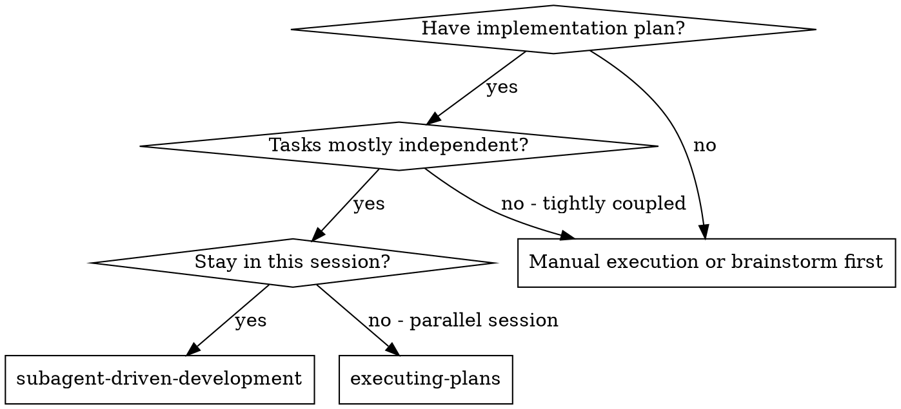
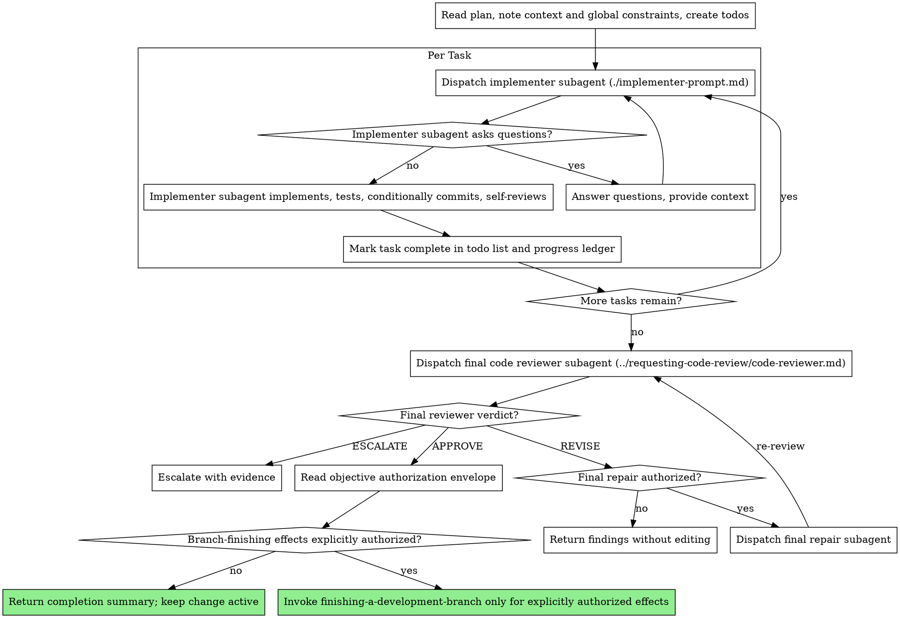

# Subagent-Driven Development

Execute plan by dispatching a fresh implementer subagent per task and a broad whole-branch review at the end. Independent review happens once at the end, not per task.

**Why subagents:** You delegate tasks to specialized agents with isolated context. By precisely crafting their instructions and context, you ensure they stay focused and succeed at their task. They should never inherit your session's context or history — you construct exactly what they need. This also preserves your own context for coordination work.

**Core principle:** Fresh implementer per task (TDD) + broad final review = high quality, fast iteration

**Narration:** between tool calls, narrate at most one short line — the
ledger and the tool results carry the record.

**Continuous execution:** Implementation runs continuously by default. The main agent remains the sole controller across implementation, review, repair, and the next dependency-ready task group. A completed task group, passing verification, an `APPROVE` verdict, a refactor, or a progress report never ends the workflow or waits for feedback. Only an `ESCALATE` boundary, explicit user interruption, or the completion gate may end the implementation workflow.

**Codex continuous controller:** Until the implementation workflow reaches every final completion gate, receives a valid `ESCALATE`, or the user explicitly stops it, the controller MUST continue execution. It MUST NOT send a `final` response after a child-agent callback, a review `REVISE`, a single wait timeout, or the end of a phase's verification.

**Codex child-agent waiting:** The single blocking-wait limit is 60 seconds. After every `spawn_agent` dispatch, repeatedly call `wait_agent` with `timeout_ms: 60000` and use `list_agents` to poll the active-agent set. When a wait times out, immediately begin the next 60-second wait while a task, repair, or review child remains active. When a callback arrives, automatically continue with its repair, verification, or next workflow phase, then resume the wait loop for every remaining active child.

**Status reports:** Any progress report MUST state the running agents, current phase, and next gate. A status report is not task completion and MUST NOT use `final` while the continuous-controller condition remains true.

Before returning a completion summary, confirm every completion gate:

- `tasks.md` contains no unchecked implementation item.
- No planned implementation task remains pending or in progress.
- The required complete verification has succeeded.
- The change scope has been reviewed and `git diff --check` succeeds.
- The final independent review is `APPROVE`.

Never use completion language or a final delivery format while any implementation task remains unchecked or in progress.

## When to Use



**vs. Executing Plans (parallel session):**
- Same session (no context switch)
- Fresh subagent per task (no context pollution)
- Broad whole-branch review at the end (no per-task review)
- Faster iteration (no human-in-loop between tasks)

## The Process



## Controller Verdict Routing

Independent review happens once, at the final whole-branch stage. During development the controller dispatches a fresh implementer per task and advances on implementer completion plus targeted verification; it does not dispatch a task-level reviewer. The routing below governs the final review.

- `APPROVE` records completion and proceeds to the authorization-envelope check below.
- The controller dispatches an authorized repair subagent for every `REVISE` finding, requires targeted verification, and dispatches a fresh independent reviewer. That reviewer must not have produced the candidate or any repair in the current cycle. Without repair authorization, a standalone read-only run returns the findings without editing, updating task state, or converting them into a user decision request.
- `ESCALATE` requests user input only for a genuine plan conflict, missing authorization, an unrecoverable uncertainty about side effects, or a repair loop that meets the no-progress boundary below.

Repeat this repair-review loop until an `APPROVE` verdict, the severity-gated closing rule below, or the no-progress `ESCALATE` boundary.

Severity-gated closing: the final repair-review loop ends on `APPROVE`, or once every Critical and Important finding has been fixed and confirmed by a fresh re-review, after at most three further review rounds; remaining Minor findings are recorded as follow-up items in the coverage ledger, not silently dropped. This closing rule does not override the no-progress `ESCALATE` below.

Ordinary errors and the first failing check are diagnostic inputs. Diagnose and repair them within scope, then run targeted verification. Escalate the same substantive issue only after three consecutive repair cycles make no verified progress; progress means fewer Important/Critical findings, fewer failing checks, or an unblocked dependency. Explanations, repeated commands, and unrelated diffs do not count.

If a reviewer fails to start, times out, crashes, or returns an invalid verdict, use the unchanged review package with a fresh independent reviewer for at most two infrastructure retries. If both retries fail, `ESCALATE` once with the collected infrastructure evidence; never infer `APPROVE`.

After final `APPROVE`, read the authorization envelope. Forgevia implement and a complete Forgevia workflow default to a completion summary with the change active. Invoke `finishing-a-development-branch` only when the envelope separately and explicitly authorizes the relevant merge, push, or cleanup effects.

## Pre-Flight Plan Review

Before dispatching Task 1, scan the plan once for conflicts:

- tasks that contradict each other or the plan's Global Constraints
- anything the plan explicitly mandates that the review rubric treats as a
  defect (a test that asserts nothing, verbatim duplication of a logic block)

Present everything you find to your human partner as one batched question —
each finding beside the plan text that mandates it, asking which governs —
before execution begins, not one interrupt per discovery mid-plan. If the
scan is clean, proceed without comment. The review loop remains the net for
conflicts that only emerge from implementation.

## Baseline Verification

Before dispatching the first implementer, run the change's baseline verification once and record a `Preflight` section in `.superpowers/sdd/progress.md`: Baseline commit (`HEAD` sha or `no-git`), Worktree snapshot (hash of `git stash list` + `git status --porcelain`; `no-git` when no repo), Command (the safe baseline command from the Verification Contract), Exit (code), Classification (`clean | in-scope-red | unrelated-red | user-worktree-red`), Evidence (artifact path or summary). This is distinct from the plan-conflict scan above: it runs a real command to capture the starting state.

The baseline is identified by the current HEAD, the worktree state, and the Verification Contract. On resumption, if `progress.md`, Git, and `tasks.md` prove the same baseline already completed, do not rerun it.

- `clean`: continue without asking.
- `in-scope-red`: the change exists to fix this failure; record and continue.
- `user-worktree-red`: uncommitted user modifications cause it; stop before writing and request a user decision.
- `unrelated-red`: a pre-existing failure unrelated to the change; do not auto-fix; request one of stop, widen scope, or accept as known-red.
- command missing or capability unavailable: diagnose, then `ESCALATE`.

Accepting a known-red requires explicit authorization and stays visible in the final report; it must never be presented as fully passing.

## Model Selection

Apply this section only when the subagent interface exposes model selection.
If it does not expose model selection, use the available interface and skip
the role-based model directives below.

Use the least powerful model that can handle each role to conserve cost and increase speed.

**Mechanical implementation tasks** (isolated functions, clear specs, 1-2 files): use a fast, cheap model. Most implementation tasks are mechanical when the plan is well-specified.

**Integration and judgment tasks** (multi-file coordination, pattern matching, debugging): use a standard model.

**Architecture and design tasks**: use the most capable available model.
The final whole-branch review is one of these — dispatch it on the most
capable available model, not the session default.

**Review tasks**: choose the model with the same judgment, scaled to the
diff's size, complexity, and risk. A small mechanical diff does not need the
most capable model; a subtle concurrency change does.

**When the platform supports model selection, specify the model explicitly
when dispatching a subagent.** Otherwise use the available subagent interface
without inventing unsupported parameters.

**Turn count beats token price.** Wall-clock and context cost scale with how
many turns a subagent takes, and the cheapest models routinely take 2-3× the
turns on multi-step work — costing more overall. Use a mid-tier model as the
floor for reviewers and for implementers working from prose descriptions.
When the task's plan text contains the complete code to write, the
implementation is transcription plus testing: use the cheapest tier for
that implementer. Single-file mechanical fixes also take the cheapest tier.

**Task complexity signals (implementation tasks):**
- Touches 1-2 files with a complete spec → cheap model
- Touches multiple files with integration concerns → standard model
- Requires design judgment or broad codebase understanding → most capable model

## Handling Implementer Status

Implementer subagents report one of four statuses. Handle each appropriately:

Before the initial implementer dispatch for each task, write `Task N: in_progress` to the progress ledger. There is no per-task review baseline — independent review happens once, at the final whole-branch stage.

**DONE:** The implementer completed the task with passing targeted verification. Mark the task complete in the todo list and progress ledger, then dispatch the implementer for the next dependency-ready task. Do not dispatch a task-level reviewer.

**DONE_WITH_CONCERNS:** The implementer completed the work but flagged doubts. Read the concerns before proceeding. If the concerns are about correctness or scope, address them (repair or re-dispatch with more context) before marking the task complete. If they're observations (e.g., "this file is getting large"), note them in the ledger and proceed.

**NEEDS_CONTEXT:** The implementer needs information that wasn't provided. Provide the missing context and re-dispatch.

**BLOCKED:** The implementer cannot complete the task. Assess the blocker:
1. If it's a context problem, provide more context and re-dispatch with the same model
2. If the task requires more reasoning, provide more context or break it into smaller pieces; when supported, use a more capable model
3. If the task is too large, break it into smaller pieces
4. If the plan itself is wrong, escalate to the human

**Never** ignore an escalation or retry with the same inputs and setup. If the implementer said it's stuck, something needs to change.

## Constructing Reviewer Prompts

The broad review happens once, at the final whole-branch review. When you fill the final reviewer template:

- Do not add open-ended directives like "check all uses" or "run race tests
  if useful" without a concrete, task-specific reason
- Do not ask a reviewer to re-run tests the implementer already ran on the
  same code — the implementer's report carries the test evidence
- Do not pre-judge findings for the reviewer — never instruct a reviewer to
  ignore or not flag a specific issue. If you believe a finding would be a
  false positive, let the reviewer raise it and adjudicate it in the review
  loop. If the prompt you are writing contains "do not flag," "don't treat X
  as a defect," "at most Minor," or "the plan chose" — stop: you are
  pre-judging, usually to spare yourself a review loop.
- The global-constraints block you hand the reviewer is its attention
  lens. Copy the binding requirements verbatim from the plan's Global
  Constraints section or the spec: exact values, exact formats, and the
  stated relationships between components ("same layout as X", "matches
  Y"). The reviewer's template already carries the process rules (YAGNI,
  test hygiene, review method) — the constraints block is for what THIS
  project's spec demands.
- Pass an explicit objective authorization envelope containing objective, scope, constraints, authorized effects, and terminal condition to every implementer and the final reviewer.
- Pass the five authorization-envelope fields to every implementer and repair-subagent dispatch, not only to reviewers.
- Hand the reviewer its diff as a file: run this skill's
  `scripts/review-package BASE HEAD` for committed work or
  `scripts/review-package TASK_TREE WORKTREE` when commits were not authorized,
  then pass the reviewer the file path it prints. The output never enters
  your own context, and the reviewer sees
  the commit list, stat summary, and full diff with context in one Read
  call. Use the BASE you recorded before dispatching the implementer —
  never `HEAD~1`, which silently truncates multi-commit tasks.
- A dispatch prompt describes one task, not the session's history. Do not
  paste accumulated prior-task summaries ("state after Tasks 1-3") into
  later dispatches — a real session's dispatch hit 42k chars of which 99%
  was pasted history. A fresh subagent needs its task, the interfaces it
  touches, and the global constraints. Nothing else.
- For a `REVISE` verdict, first classify every finding against the active
  authorization envelope. Dispatch an authorized repair subagent with every
  `REVISE` finding. In a standalone read-only run, return all findings without
  editing.
- A finding labeled plan-mandated — or any finding that conflicts with
  what the plan's text requires — is the human's decision, like any plan
  contradiction: present the finding and the plan text, ask which governs.
  Do not dismiss the finding because the plan mandates it, and do not
  dispatch a fix that contradicts the plan without asking.
- The final whole-branch review gets a package too: run
  `scripts/review-package MERGE_BASE HEAD`, or use `WORKTREE` instead of HEAD
  when authorized changes remain uncommitted (MERGE_BASE = the commit the
  branch started from, e.g. `git merge-base main HEAD`) and include the
  printed path and the objective authorization envelope in the final review
  dispatch, so the final reviewer reads one file instead of re-deriving the
  branch diff with git commands and can classify repair authorization.
- Every repair subagent re-runs the tests covering its change and reports the
  command and result before the controller dispatches a fresh independent
  reviewer. A one-line fix does not need the whole suite, but it must include
  the tests that cover the finding.
- If the final whole-branch review returns `REVISE` and repair is authorized,
  the controller dispatches one repair subagent with the complete findings
  list, reruns full verification, and dispatches a fresh independent final
  reviewer. Without repair authorization, return the findings unchanged.

## File Handoffs

Everything you paste into a dispatch prompt — and everything a subagent
prints back — stays resident in your context for the rest of the session
and is re-read on every later turn. Hand artifacts over as files:

- **Task brief:** before dispatching an implementer, run this skill's
  `scripts/task-brief PLAN_FILE N` — it extracts the task's full text to a
  uniquely named file and prints the path. Compose the dispatch so the
  brief stays the single source of requirements. Your dispatch should
  contain: (1) one line on where this task fits in the project; (2) the
  brief path, introduced as "read this first — it is your requirements,
  with the exact values to use verbatim"; (3) interfaces and decisions
  from earlier tasks that the brief cannot know; (4) your resolution of
  any ambiguity you noticed in the brief; (5) the report-file path and
  report contract. Exact values (numbers, magic strings, signatures, test
  cases) appear only in the brief.
- **Report file:** name the implementer's report file after the brief
  (brief `…/task-N-brief.md` → report `…/task-N-report.md`) and put it in
  the dispatch prompt. The implementer writes the full report there and
  returns only status, commits, a one-line test summary, and concerns.
- **Final reviewer inputs:** the final whole-branch reviewer gets the review
  package path (from `scripts/review-package MERGE_BASE HEAD`, or `WORKTREE`
  instead of HEAD when changes remain uncommitted), the objective
  authorization envelope, and the global constraints.
- Fix dispatches append their fix report (with test results) to the same
  report file and return a short summary; re-reviews read the updated file.

## Durable Progress

Conversation memory does not survive compaction. In real sessions,
controllers that lost their place have re-dispatched entire completed task
sequences — the single most expensive failure observed. Track progress in
a ledger file, not only in todos.

- At skill start and after context compaction, rebuild the recovery view from
  `tasks.md`, Git history, and `.superpowers/sdd/progress.md`. Check for the
  ledger in the SDD workspace (the directory
  `scripts/sdd-workspace` resolves): `cat "$(git rev-parse --show-toplevel)/.superpowers/sdd/progress.md" 2>/dev/null`.
  An empty result means no ledger yet — start fresh. Treat each ledger completion line as evidence, not an unconditional DONE state. A task is
  complete only when the tasks checklist, named Git commits/diff, and
  verification evidence corroborate it; resume at the first task whose
  completion cannot be established from those facts.
- If tasks, Git, and progress disagree, inspect the actual diff and verification evidence before deciding whether to continue, repair bookkeeping, or `ESCALATE`.
  Repair bookkeeping only to reflect a completion state proven by repository
  evidence. Escalate when an external or irreversible side effect cannot be
  determined safely; never guess or replay it blindly.
- When a task completes (implementer DONE with passing targeted verification),
  append one line to the ledger in the same message as your other bookkeeping.
  Use `Task N: complete (commits <base7>..<head7>)` for committed work, or
  `Task N: complete (worktree <summary>)` when commits were not authorized.
- The ledger is one recovery map: verify that its named commits exist and
  match the task diff and verification evidence after compaction. Do not prefer it
  over conflicting tasks or Git facts.
- `git clean -fdx` will destroy the ledger (it's git-ignored scratch); if
  that happens, recover from `git log`.

## Task Status Sync (Required for OpenSpec Work)

When the plan is an OpenSpec change (`openspec/changes/<change-name>/tasks.md`), the progress ledger above tracks the SDD controller's recovery state; the OpenSpec `tasks.md` is the real-time checklist of record — keep both current. The "task" granularity here is the numbered capability group (`## N.`) that `scripts/task-brief` extracts; flip every item in that group together.

- After a task group completes (the same moment you append the ledger line), flip its items in `openspec/changes/<change-name>/tasks.md` from `[ ]` to `[x]`.
- When a task is blocked, add a short inline blocker note on the unfinished item instead of leaving it unchecked.
- Do not batch `tasks.md` updates at the end of the run; do not claim progress that `tasks.md` does not reflect.

## Prompt Templates

- [implementer-prompt.md](implementer-prompt.md) - Dispatch implementer subagent
- Final whole-branch review: use superpowers:requesting-code-review's [code-reviewer.md](../requesting-code-review/code-reviewer.md)

## Example Workflow

```
You: I'm using Subagent-Driven Development to execute this plan.

[Read plan file once: openspec/changes/<change-name>/tasks.md]
[Create todos for all tasks]

Task 1: Hook installation script

[Run task-brief for Task 1; dispatch implementer with brief + report paths + context]

Implementer: "Before I begin - should the hook be installed at user or system level?"

You: "User level (~/.config/superpowers/hooks/)"

Implementer: "Got it. Implementing now..."
[Later] Implementer:
  - Implemented install-hook command
  - Added tests, 5/5 passing
  - Self-review: Found I missed --force flag, added it
  - Committed

[Mark Task 1 complete]

Task 2: Recovery modes

[Run task-brief for Task 2; dispatch implementer with brief + report paths + context]

Implementer: [No questions, proceeds]
Implementer:
  - Added verify/repair modes
  - 8/8 tests passing
  - Self-review: Caught a missing progress report (spec says "report every 100 items") and an unrequested --json flag; removed the flag and extracted PROGRESS_INTERVAL
  - Committed

[Mark Task 2 complete]

...

[After all tasks]
[Dispatch final code-reviewer with the whole-branch review package]
Final reviewer: Verdict: APPROVE. All requirements met, ready to merge

Done!
```

## Advantages

**vs. Manual execution:**
- Subagents follow TDD naturally
- Fresh context per task (no confusion)
- Parallel-safe (subagents don't interfere)
- Subagent can surface a genuine plan conflict or missing authorization

**vs. Executing Plans:**
- Same session (no handoff)
- Continuous progress (no waiting)
- Review checkpoints automatic

**Efficiency gains:**
- Controller curates exactly what context is needed; bulk artifacts move
  as files, not pasted text
- Subagent gets complete information upfront
- Questions surfaced before work begins (not after)

**Quality gates:**
- Self-review catches issues before the final review
- Implementer TDD keeps each task verifiable as it is built
- One broad final review catches integration and cross-task issues
- Review loops ensure fixes actually work
- Spec compliance prevents over/under-building
- Code quality ensures implementation is well-built

**Cost:**
- One implementer dispatch per task plus one final review (fewer review subagents than per-task review)
- Controller does more prep work (extracting all tasks upfront)
- Final review loop may iterate on Critical/Important findings
- Defers cross-task findings to the end (trade-off for uninterrupted development)

## Red Flags

**Never:**
- Start implementation on main/master branch without explicit user consent
- Proceed with unfixed issues
- Dispatch multiple implementation subagents in parallel (conflicts)
- Make a subagent read the whole plan file (hand it its task brief —
  `scripts/task-brief` — instead)
- Skip scene-setting context (subagent needs to understand where task fits)
- Ignore subagent questions (answer before letting them proceed)
- Dispatch the final reviewer without a diff file — generate the whole-branch
  review package first (`scripts/review-package MERGE_BASE HEAD`, or `WORKTREE`
  instead of HEAD when changes remain uncommitted) and name the printed path
  in the prompt
- Tell a reviewer what not to flag, or pre-rate a finding's severity in the
  dispatch prompt ("treat it as Minor at most") — the plan's example code is
  a starting point, not evidence that its weaknesses were chosen
- Let implementer self-review replace the independent final review (both are needed)
- Skip the final review, or accept completion while the final review has open Critical/Important issues
- Close the final review by severity-gated rounds while Critical/Important findings remain unfixed
- Re-dispatch a task the progress ledger already marks complete — check
  the ledger (and `git log`) after any compaction or resume
- Skip `openspec/changes/<change-name>/tasks.md` status updates after a task group completes or blocks

**If subagent asks questions:**
- Answer clearly and completely
- Provide additional context if needed
- Don't rush them into implementation

**If reviewer finds issues:**
- Route the verdict against the active authorization envelope
- For authorized `REVISE`, dispatch a repair subagent with the findings and require targeted tests
- A fresh independent reviewer reviews again
- Repeat while verified progress continues; apply the three-cycle no-progress boundary
- Don't skip the re-review

**If subagent fails task:**
- Diagnose the failure and either provide the missing context to the implementer or dispatch a repair subagent when authorized
- Return findings without editing when the run is standalone and read-only
- Escalate only at a Controller Verdict Routing boundary
- Keep reviewer and candidate-producer identities separate on every repair cycle

## Integration

**Required workflow skills:**
- **superpowers:using-git-worktrees** - Ensures isolated workspace (creates one or verifies existing)
- **superpowers:writing-plans** - Creates the plan this skill executes
- **superpowers:requesting-code-review** - Code review template for the final whole-branch review
- **superpowers:finishing-a-development-branch** - Perform only explicitly authorized branch-finishing effects after final review

**Subagents should use:**
- **superpowers:test-driven-development** - Subagents follow TDD for each task

**Alternative workflow:**
- **superpowers:executing-plans** - Use for parallel session instead of same-session execution
